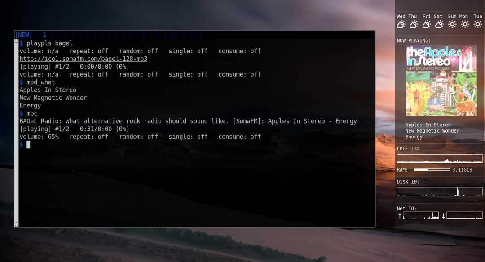

# mpd_what
An mpd album art and info getter

mpd_what is a python script to grab album art and find out what is playing. In addition to finding art and info for what you're playing locally, it also will try to find art and info for internet radio stations you might be playing. I'm not aware of any other mpd album art getters that do this. Since every internet radio station is unique in its configuration, this script doesn't work with all of them, and probably it never will, but it tries to do the best it can.

As of August 2019, mpd_what can scrobble your music to last.fm or libre.fm (or both!). Huzzah! Now last.fm can dig all those cool grooves I've been playing from somafm's streams.

Getting started:

    pip3 install mpd_what
    
Next, create a config.yml in `~/.config/mpd_what` with the following:

    mpd_host: localhost
    mpd_port: 6600
    coverart_dir: /tmp/mpd_what/coverart
    
replacing /tmp/mpd_what/coverart with your preferred coverart area (I like hosting my coverarts on my webserver) and optionally:

    lastfm_user: <your lastfm username>
    lastfm_pass: <your lastfm password>
    lastfm_api_key: <your lastfm api key, which you can get at https://www.last.fm/api/account/create>
    lastfm_api_secret: <your lastfm shared secret, same as above>
    librefm_user: <your librefm username>
    librefm_pass: <your librefm password>
    
 If you choose librefm, but not lastfm, then add lastfm_api_key and lastfm_api_secret, and set them to some random 32-character strings. You can get some random strings by installing pwgen, and invoking it like so:
 
     pwgen 32 2 -1
     
Next, execute
    
    ./mpd_what -g

You can find the available options with

    ./mpd_what -h

You can add a link to cover.jpg in your .conkyrc, or you can install qiv, then use `qiv --watch` to reload cover.jpg when it changes. Even better, you can have conky automatically call mpd_what to give you album art and info. Here are the pertinent lines in my own .conkyrc:

    ${color}${if_mpd_playing}
    ${color 333333}$hr
    ${color white}NOW PLAYING:
    ${image /var/www/html/coverart/cover.jpg -s 200x200 -p 25,123 -f 3}
    
    
    
    
    
    
    
    
    
    
    
    
    ${execi 2 ~/bin/mpd_what -sc -g | sed 's/^/   /g'}${if_match "${mpd_artist}" != ""}
        ${color}${mpd_bar 3,200}${endif}${endif}

